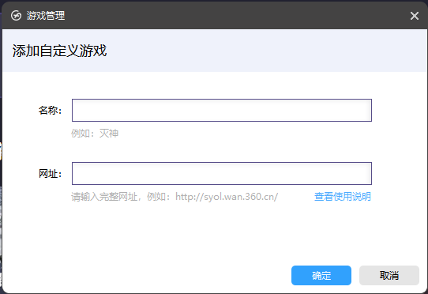
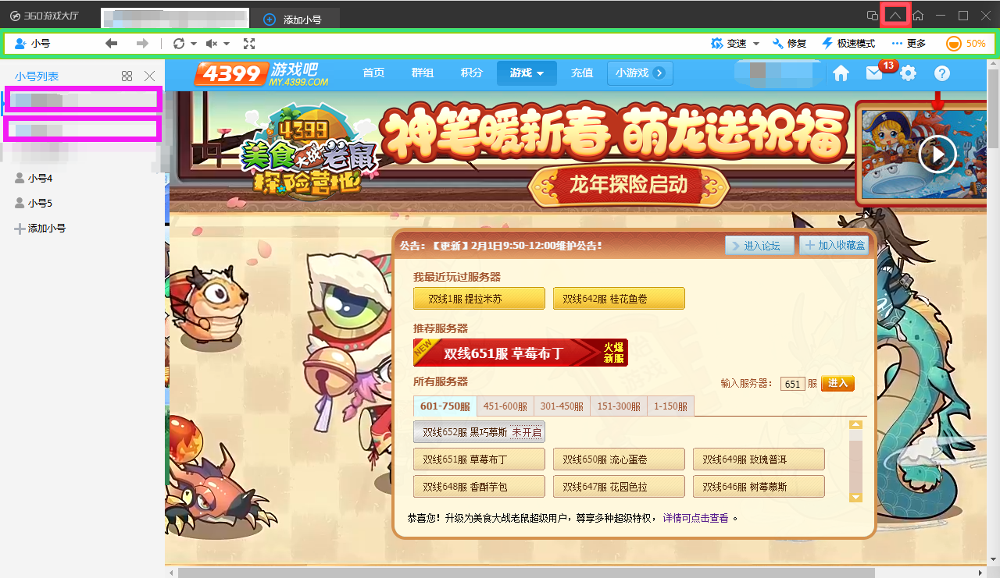

# 第3步 配置360游戏大厅

## 下载并安装360游戏大厅.
[360游戏大厅 - 官网](https://360game.360.cn/)
::: warning 不推使用网传魔改版, 它们可能包含恶意病毒或无法正常启用 :::
::: tip 您可以在360游戏大厅设置中, 关闭所有广告弹窗相关的选项 :::

## 打开360游戏大厅，创建游戏
1. 点击左下角创建游戏

2. 输入游戏名称和url

* 游戏名称
    * 任何好记忆的顺耳的都可以, 比如`美食-4399`
* url 不同的区服输入不同
    * 4399服 微端: https://my.4399.com/yxmsdzls/wd-air (强烈推荐, 降低卡顿)
    * 4399服：https://my.4399.com/yxmsdzls
    * QQ空间服 & 3366：https://game.qzone.qq.com/13057
    * QQ大厅服：https://qqgame.qq.com/webappframe/?appid=10802

## 360中设置自动登录
::: tip 若您已熟练使用360游戏大厅游玩该游戏，可跳过本小节 :::

### 必要步骤
1. 点击上箭头（上图右上角红框标识），显示工具栏（上图绿框标识）；
2. 确保绿色框中，显示**极速模式**，而非兼容模式，如有问题请点击调整；
3. 保证浏览器窗口大小能**完整显示美食大战老鼠Flash**，否则之后会遇无限卡登陆等各种问题；
4. 在工具栏中，点击小号图标，打开小号列表；
### 注册账号
1. 在小号列表中，选择第一个（上图紫框标识），右键修改账号；
2. 输入您的账号密码，以方便刷新后完成自动登录，此处的昵称随便取；
3. 点击工具栏中的刷新按钮（转圈箭头图标），一次到两次，完成登录，并至少进入一次游戏，保证**我最近玩过的服务器下第一个是您要登录的服务器**；
### 双人游戏额外步骤
1. 在小号列表中，选择第二个（上图紫框标识），右键修改账号，重复`注册账号`的后续步骤；
2. 点击上图红框标识左侧的按钮，拆分为**多窗口模式**；
