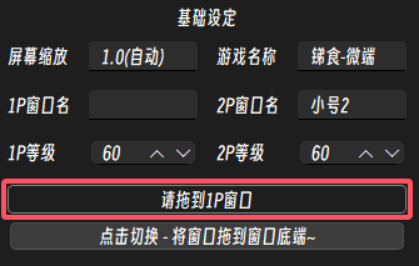
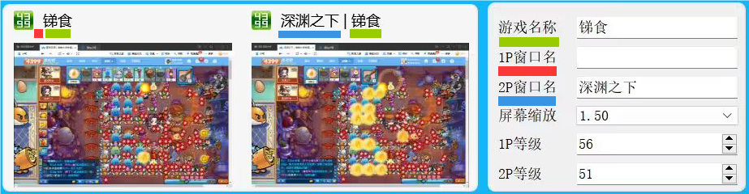
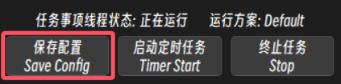

# 第4步 配置FAA

## 窗口名和游戏名称

1.游戏角色进入游戏
2.找到 `请拖到1P窗口` , 跟随指示拖拽到游戏窗口
  * 双人：跟随指示分别拖动到1P和2P窗口
  * 单人：两次拖拽都拖动到1P窗口

<!-- * 版本号: v1.4.1- 请根据下文操作填写.
  * 360游戏大厅在 `添加游戏` 时, 你所填写的 `游戏名称`, 为软件中需要填写的 `游戏名称`.
  * 360游戏大厅在 `添加小号` 时, 你所填写的 `角色名字`, 为软件中需要填写的 `1P和2P的窗口名`.
  * 360游戏大厅中第一个启动的角色, 其窗口名需要空置, 请保持每次启动360游戏大厅时第一个开启的角色是相对固定的.
  * 具体可以参考下图.
    * 将鼠标悬停在windows任务栏中的360游戏大厅的窗口上, 启动1P和2P时可以看到. 为 角色名称 | 游戏名称 或 游戏名称.
    * 其中 仅有游戏名称, 为第一个启动的角色, 对应在软件中, 其窗口名空置.
    * 其中 角色名称 | 游戏名称, 为之后启动的角色, 对应在软件中, 填写角色名称.

     -->

## 角色等级

* 如实填写即可.
* 用于在任务需要完成高等级解锁的副本, 但角色等级不足时, 直接跳过对应任务, 防止卡死.

## 屏幕缩放

::: warning 请满足以下几点
* 确保你的屏幕缩放在200%或更低.
* 尽可能让360游戏大厅窗口缩小, 贴近游戏Flash窗口.
* 游戏Flash窗口完整显示在屏幕上.
:::

* FAA将获取您的缩放倍率, 无需填写.

<!-- * 低版本(v0.9.1-) 需要手动填写
  * 填错不会有报错和卡死, 但运行会异常. 
  * win10 win11 用户 -> 桌面右键  ->  显示设置 -> 缩放和布局 -> 缩放中的数值, 记住它 然后在软件中进行选择.  -->

## 记得保存
完成上述项的填写后, 请保存!
::: caution 
FAA的所有配置项, 都必须**先保存再运行**! 
FAA**不应用实时更改**, 即：运行中进行的配置更改并保存后, 需要重新开始任务后才会被应用.
:::

## 不同渠道的额外步骤

### 4399渠道服

* v0.9.1+ 支持, 无需额外配置.

### QQ游戏大厅渠道服

* v1.0.7+ 支持, 无需额外配置.

### QQ空间渠道服

* v0.9.1+ 支持, 需额外截图, 并在运行期间在电脑上登录对应QQ账号, 以进行快速登录.
* 配置步骤
  * 先开启并关闭一次FAA, 初始化资源文件.
  * 将操作系统调整为`100%缩放倍率`. 截图完成后可以调回去.
  * 在软件根目录的 `config\cus_images\用户自截\` 中修改 `空间服登录界面_1P` 和 `空间服登录界面_2P`.
  * 需在快捷登录界面, 分别截图1P和2P上半部分QQ头像为 `.png` 格式, 覆盖对应图像.
::: warning 请不要覆盖文件名为`XXX_template.png`的文件, 它们是初始化时的模板文件 而非软件调用的文件 :::
  
### 3366渠道服

* v1.5.0+支持, 需额外截图.
* 配置步骤
  * 完成QQ空间渠道服所有步骤.
  * 将操作系统调整为`100%缩放倍率`. 截图完成后可以调回去.
  * 在软件根目录的`\resource\picture\common\登录\`中修改`1_我最近玩过的服务器_QQ空间.png`.
  * 需在区服选择界面, 截图你需要进入的区服的上方的、有特征的像素, 覆盖该图片. FAA将点击该图片的位置下方, 来选择区服. 