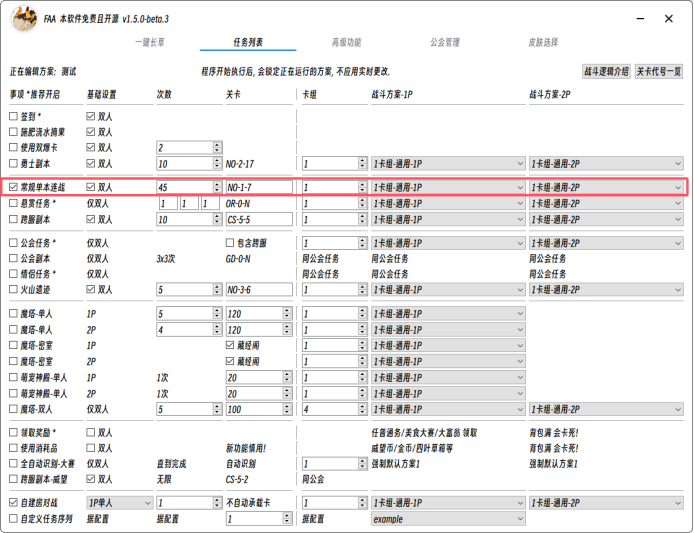

# 第5步 你的第一套战斗方案

接下来, 你需要为你的任务事项选择战斗方案, 并在游戏中配置好对应的卡组.
请参考下文，使用内置战斗方案 `1卡组-通用` 或 `萌新-煮蛋器忍坤狮子座` 准备第一场战斗吧!

## 设置战斗方案

本软件支持高度可自定义的共享式战斗方案, 也包含了大量成熟的 `内置战斗方案`, 以满足大多数玩家的使用需求.  
下文仅例举一个卡组, 考虑到版本更新和文档维护的滞后性, 更多卡组请使用 `方案编辑器` 直接查看带卡要求!

* 战斗方案的基本讲解
  * 左侧列表从上到下顺序: 代表战斗中使用的从高到低优先级.
  * id：代表其在卡槽中的位置.
  * kun参数: 代表是否可被幻鸡复制, 优先级值越高越先被复制, 0则不复制.

* 默认1号卡组

  * 用于通勤, 可通杀大多数关卡, 包括: 所有公会任务 / 所有情侣任务 / 大多数悬赏任务 / 火山遗迹 / 勇士 / 单人魔塔120 / 跨服巫毒12(或更高) / 一键自动大赛等.
  * 如果需要完成 `需要携带某卡片` 的公会任务 / 大赛任务, 必须使用该卡组或仿照卡组, 空格收尾, 之后携带可选部分.
  * 可选部分: 以任意顺序携带可选的 承载卡 / 极寒冰沙 / 幻幻鸡.
    * 为使一个卡组兼容大多数关卡, 可在海底白天关卡设置可选部分为: [木盘子 | 麦芽糖 | 气泡 | 咖啡粉]. 仅做示例, 魔法软糖等其他承载卡均可加入.
    * 极寒冰沙仅支持二转, 不支持自动使用冰淇淋.
    * 幻幻鸡和创造神均支持, 且可以同时使用.

    |    | 1  | 2  | 3  | 4  | 5     | 6  | 7  | 8  | 9  |
    |:---|:---|:---|:---|:---|:------|:---|:---|:---|:---|
    | 1P | 产火 | 海星 | 防空 | 瓜皮 | 旋转喷壶  | 油灯 | 布丁 | 空格 | 可选 |
    | 2P | 产火 | 海星 | 防空 | 瓜皮 | 旋转喷壶  | 油灯 | 布丁 | 空格 | 可选 |

* 花瓶卡组

    |    | 1  | 2 | 3 | 4 | 5 | 6 | 7 | 8 | 9 |
    |:---|:---|:--|:--|:--|:--|:--|:--|:--|:--|
    | 2P | 可选 |   |   |   |   |   |   |   |

    ::: tip 即使是花瓶, 仍必须分担承载卡任务, 可以让没练度的2P小号作为挂件加入战斗 :::

## 在FAA中选择战斗方案

选择好您的各项配置, 并使用默认方案准备开始吧!

::: tip 卡组
您将战斗方案对应的卡片放置在了游戏的第几个卡组内, 就填写为几.
可以鼠标滚轮直接滑动选择哦~
:::

::: caution 记得保存 
再次提醒 FAA的所有配置项, 都需要先保存再运行! 
:::